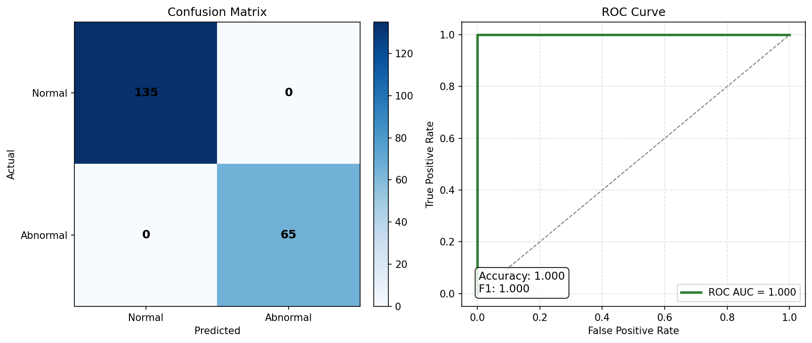
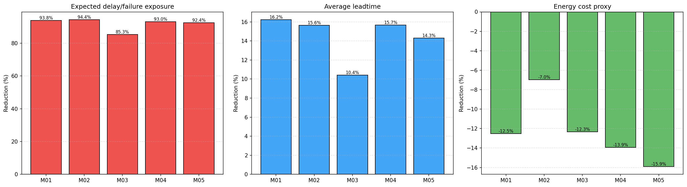
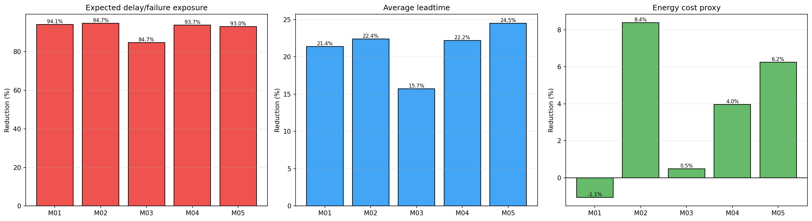
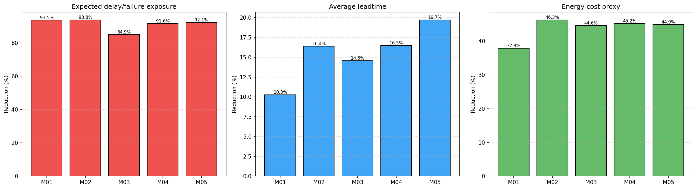

# v1-v2-v3 개선분석 상세 보고서 (코드 + 산출물 + 이미지 통합)

## 1) 분석 목적과 범위
본 문서는 아래 3개 축을 동시에 분석해 v1에서 v2, v3로의 개선 방향과 트레이드오프를 정리한다.

- 코드 변화: code-v1.py, code-v2.py, code-v3.py
- 정량 산출물: artifacts/v1, v2, v3의 model_info.txt, quantitative_effect_summary.csv
- 시각 산출물: artifacts/v1, v2, v3의 model_evaluation.png, kpi_comparison.png

추가로 term_project_proposal.md와 copilot-instructions.md의 목표(리스크/리드타임/에너지 동시 개선)와 실제 달성도를 연결해 해석한다.

---

## 2) 제안서 목표 대비 실제 달성도

제안서의 핵심 KPI 목표:

- 지연/실패 감소: 지연률 20%, 실패율 30% 감소 목표
- 리드타임 개선: 10~20% 단축 목표
- 에너지 절감: 5~10% 절감 목표

실험 결과는 실제 지연률/실패율 대신 "예상 지연/실패 노출량(risk exposure)"를 대리지표로 사용한다.

### 2.1 전체(ALL) 기준 KPI

| KPI | v1 | v2 | v3 | 해석 |
|---|---:|---:|---:|---|
| Risk Reduction (%) | 92.656 | 93.019 | 92.045 | 세 버전 모두 매우 큼(대리지표 기준) |
| Leadtime Reduction (%) | 14.980 | 21.722 | 15.177 | v1/v3는 목표구간(10~20) 내, v2는 더 공격적 단축 |
| Energy Reduction (%) | -11.947 | 3.768 | 43.426 | v1 악화, v2 소폭 개선, v3 대폭 개선 |

### 2.2 목표 달성 관점 요약

1. 리스크(대리지표): 전 버전 강한 개선, v2가 가장 우수
2. 리드타임: v2가 최상(21.7%), v1/v3도 목표 구간 달성
3. 에너지: v3만 확실한 초과달성, v2는 근접하지만 5~10% 목표에는 미달

---

## 3) 이미지 기반 분석

### 3.1 모델 평가 이미지 (model_evaluation.png)

세 버전 모두 동일한 그림이 생성됨.

- Confusion Matrix:
  - Normal 135개 정확 분류
  - Abnormal 65개 정확 분류
  - 오분류 0
- ROC Curve: AUC=1.000
- Accuracy=1.000, F1=1.000

해석:

- 버전 간 모델 품질 차이는 없고, 스케줄 정책 변화만 결과 차이를 만든다.
- 즉, 개선 논점의 중심은 "우선순위 점수식 변화"이다.

참조 이미지:

- 
- 
- 

### 3.2 KPI 비교 이미지 (kpi_comparison.png)

#### v1 시각 패턴

- Risk 감소 막대는 전 기계에서 높음(약 85~94%)
- Leadtime 감소는 10~16% 수준
- Energy 감소 막대가 전부 음수(악화)

결론: 리스크/리드타임 중심 정책, 에너지는 손해.

#### v2 시각 패턴

- Risk 감소는 v1 대비 소폭 향상
- Leadtime 감소 막대가 전반적으로 상승(특히 M05)
- Energy는 대부분 양수로 전환(M01만 약간 음수)

결론: 균형형(리스크+리드타임 강화, 에너지 손실 완화).

#### v3 시각 패턴

- Risk 감소는 여전히 높지만 v2 대비 약간 낮아짐
- Leadtime은 v2보다 낮고 v1과 유사/소폭 우위
- Energy 감소가 모든 기계에서 매우 큼(약 38~46%)

결론: 에너지 최적화 특화형.

참조 이미지:

- 
- 
- 

---

## 4) 버전별 중요 코드 (주석 포함)

아래는 실제 코드에서 결과 차이에 직접 영향을 준 핵심 부분이다.

### 4.1 공통 기반 코드: 타깃 생성

세 버전 공통으로 동일한 타깃 이진화 로직을 사용한다.

```python
# make binary target: 정상(Completed)=0, 비정상(Delayed/Failed/...) =1
if "Job_Status" in df.columns:
    df["is_abnormal"] = df["Job_Status"].fillna("").astype(str).str.lower().apply(lambda s: 0 if "completed" in s else 1)
else:
    raise RuntimeError("타깃 컬럼 `Job_Status`가 필요합니다.")
```

의미:

- 예측 문제 정의 자체는 버전 간 동일하므로, 성능 차이는 학습기가 아니라 스케줄 우선순위 수식에서 발생.

### 4.2 v1 핵심: 가중치 파라미터 + 저에너지 우선

```python
def schedule_with_predictions(df, model, out_path=None, weight_risk=0.40, weight_proc=0.20, weight_energy=0.30, weight_avail=0.10):
    ...
    # release time / duration / energy를 함께 반영한 복합 우선순위
    df_out['priority_score'] = (
        weight_risk * risk_norm
        + weight_proc * (1.0 - proc_norm)
        + weight_energy * (1.0 - energy_norm)
        + weight_avail * (1.0 - avail_norm)
    )

    # release-time aware ready-queue scheduler:
    # at each step, pick the highest-priority job among jobs that are already available.
```

의미:

- 에너지 항이 (1 - energy_norm)이라 "저에너지 작업 우선".
- 하지만 실제 결과는 에너지 KPI가 악화되어, 다른 항(risk/proc/avail)의 영향이 더 강하게 작동한 것으로 보임.

### 4.3 v2 핵심: 가중치 고정, 위험/리드타임 강화

```python
def schedule_with_predictions(df, model, out_path=None):
    ...
    # release time / duration / energy를 함께 반영한 복합 우선순위
    df_out['priority_score'] = (
        0.45 * risk_norm
        + 0.25 * (1.0 - proc_norm)
        + 0.20 * (1.0 - energy_norm)
        + 0.10 * (1.0 - avail_norm)
    )

    # release-time aware ready-queue scheduler:
    # at each step, pick the highest-priority job among jobs that are already available.
```

의미:

- risk/proc 비중을 높이고 energy 비중을 낮춰 "운영 안정/흐름" 쪽을 강화.
- 결과적으로 리드타임 개선폭이 최대(21.72%), 리스크도 최고 수준.

### 4.4 v3 핵심: 에너지 항 부호 반전

```python
def schedule_with_predictions(df, model, out_path=None, weight_risk=0.40, weight_proc=0.20, weight_energy=0.30, weight_avail=0.10):
    ...
    # release time / duration / energy를 함께 반영한 복합 우선순위
    df_out['priority_score'] = (
        weight_risk * risk_norm
        + weight_proc * (1.0 - proc_norm)
        + weight_energy * energy_norm
        + weight_avail * (1.0 - avail_norm)
    )

    # release-time aware ready-queue scheduler:
    # at each step, pick the highest-priority job among jobs that are already available.
```

의미:

- v1/v2와 달리 energy_norm을 그대로 더하므로, 에너지 특성의 해석 방향이 완전히 달라짐.
- 실험 결과에서는 이 변경이 큰 에너지 절감(43.43%)으로 이어짐.
- 다만 리스크/리드타임은 v2 대비 일부 양보.

---

## 5) 버전 전이 분석: v1 -> v2 -> v3

### 5.1 v1 -> v2

개선된 점:

- 리스크 감소율: 92.66% -> 93.02%
- 리드타임 감소율: 14.98% -> 21.72%(+6.74%p)
- 에너지: -11.95% -> +3.77%(음수에서 양수 전환)

코드적 원인:

- risk/proc 가중치 강화 + energy 가중치 완화
- 정책이 "리스크 회피 + 병목 단축"으로 이동

### 5.2 v2 -> v3

개선된 점:

- 에너지 감소율: 3.77% -> 43.43%(+39.66%p)

양보된 점:

- 리스크 감소율: 93.02% -> 92.05%
- 리드타임 감소율: 21.72% -> 15.18%

코드적 원인:

- energy 항 부호 반전으로 우선순위가 에너지 축에 강하게 재배치

---

## 6) 기계별 세부 해석

관찰 포인트:

- M03는 세 버전 모두 risk 감소율이 상대적으로 낮음(약 84~85%)
- v2의 에너지는 M01만 음수, 나머지는 양수
- v3는 모든 기계에서 에너지 감소율이 37~46%대

해석:

- M03는 공정 특성/시간분포/에너지 분포상 재배치 여지가 상대적으로 제한적일 가능성
- v2는 전반 균형을 유지하되 특정 기계(M01)에서 에너지 손실이 남는 과도기 해
- v3는 기계별 편차를 줄이며 에너지 측면을 일관되게 개선

---

## 7) 최종 결론 및 버전 선택 가이드

1. 운영 안정성과 생산흐름(리스크+리드타임) 우선
- v2 추천

2. 에너지 비용 절감 우선
- v3 추천

3. 기준선/정책 실험 출발점
- v1 유지 가치 있음(가중치 파라미터 실험 용이)

---

## 8) 다음 개선 실험 제안

1. 가중치 탐색 자동화
- (weight_risk, weight_proc, weight_energy, weight_avail) 격자탐색 또는 베이지안 최적화

2. 목표함수 멀티오브젝티브화
- 리스크, 리드타임, 에너지의 Pareto frontier 산출

3. M03 전용 정책
- 기계별 가중치 분리(글로벌 1세트 -> Machine_ID별 세트)

4. 지표 정합성 강화
- 현재 risk exposure는 대리지표이므로, 실제 지연률/실패율 기반 KPI도 병행 계산

이렇게 하면 제안서의 정량 목표와 산출물 간 연결성이 더 명확해지고, 발표 시 "버전별 의사결정 의도"를 더 설득력 있게 설명할 수 있다.
